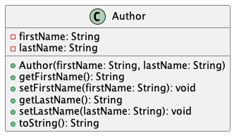
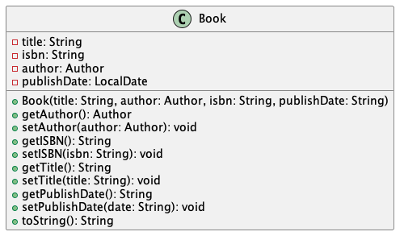
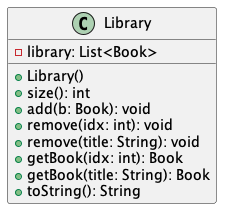
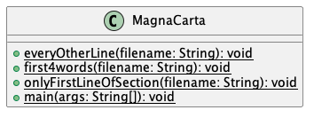
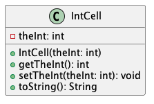
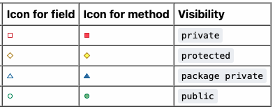

# Programming II

## Lab 4: Lasallian Library

### Classes & Constructors

In this lab, you will practice topics related to classes, including fields, methods, and constructors. You will construct classes that model a library.

### Attribution

This lab is used in CS 222 at Saint Mary's College of California.
This lab is originally based on Dr. Chris Bourke's "Lab 03", which is used in CSCE 156 (Computer Science II) at the University of Nebraska-Lincoln. In 2025, Dr. Sarah Roscoe restructured the lab, and instructions were rewritten.

### Important Note

In this lab, you will write classes that depend on each other. Make sure you approach the activity in order; otherwise, you may face errors and/or confusion. As a result of this stacking, when trying to execute code, your IDE will warn you that the project has errors. Just keep working. When you are done with the lab, all errors should be gone.

This lab also contains images of UML digrams. They are briefly explained [here](#uml-diagram).

## Instructions

1. Clone this lab from Github. Use this link: <https://github.com/sroscoe2/CS222-Lab-04.git> Refer to Lab 1 if you need a refresher for how to do so. REMEMBER: when importing, name your folder `firstnameLI-CS222-Lab-04`

### Beginning (`Author.java`)
<p align="center">

</p>

2. Open `Author.java`. Much of the class has been provided to you already. **Fix the `get...()` methods**, which currently return `null`. They should instead return the appropriate field.

3. [Hints](#how-to-generate-class-members-in-your-ide) Add a constructor to the `Author` class. The constructor should have the following signature:

```java
public Author(String firstName, String lastName) {
  //TODO: your code here
}
```

4. [Hints](#how-to-print-an-object) Implement a `toString()` method which returns the author's name formatted as `[LastName], [FirstName]`. For example, Rick Riordan gets a String representation of `Riordan, Rick`. **Reminder:** Add comments!

5. Run `AuthorTests.java` and ensure all test cases pass.

### Middle (`Book.java`)

<p align="center">

</p>

6. [Hints](#how-to-generate-class-members-in-your-ide) Open `Book.java`. Fields have been provided to you, but no methods. Write getter & setter methods, or have your IDE generate them for you.

7. The fields of `Book` are currently publicly visible; correct this.

8. There is no constructor; create one with the following signature:

```java
public Book(String title, Author author, String isbn, String publishDate) {
  //TODO: your code here
}
```

9. [Hints](#how-to-print-an-object) Create and add a `toString()` method which prints information in the following format:

```txt
[Author]. "[Title]". [ISBN]. Published [PublishDate].
```

For example, the book "Don Quijote" by Miguel de Cervantes, (which was translated by Burton Raffel) with ISBN 978-0393315097 and published on September 17, 1996, would be printed as

```txt
de Cervantes, Miguel. "Don Quijote".  978-0393315097. Published 1996-09-17.
```

10. Run `BookTests.java` and ensure all test cases pass.

### End (`Library.java`)

11. The Library class file is provided, but it is completely empty. Implement it based on the UML diagram seen below. [UML Explained](#uml-diagram)

<p align="center">

</p>

Ensure you have:

- A field, according to its visibility in the diagram.
  - `library`, which is declared as a `List` containing `Book`s. [Hint](#declaring-and-instantiating)

- Constructor(s) [Hint](#declaring-and-instantiating)

- Methods [Hint](#list-methods)
  - `size()` returns how many books are currently in the library.
  - `add()` adds a book to the library.
  - `remove(int idx)` removes the indexed book from the library.
  - `remove(String title)` searches for the titled book in the library, and removes it from the library. [Hint](#library-hints)
  - `getBook(int idx)` returns the indexed book from the library.
  - `getBook(String title)` searches for the titled book in the library, and returns it. Returns `null` if not found. [Hint](#library-hints)
  - `toString()` ([Hint](#library-hints)) returns the following:

```txt
Library:
1. [Book citation]
2. [Book citation]
```

For example, a library with 3 books would output the following:

```txt
Library:
1. de Cervantes, Miguel. "Don Quijote". 978-0393315097. Published 1996-09-17.
2. Riordan, Rick. "The Lightning Thief". 978-0786856299. Published 2005-06-28.
3. Dabos, Christelle. "A Winter's Promise". 978-1609454838. Published 2018-09-25.
```

12. Run `LibraryTests.java` and ensure all test cases pass.

### Finishing Up

13. Zip your project folder and turn it into Canvas. Refer to Lab 1 if you need a refresher for how to do so.

[Go back to the top](#instructions)

## Explanations

### How to print an object

Java has a method it calls when a String representation of an object is requested. That method is called `toString`. Its signature must be exactly `public String toString()`; that is, it must be public, must have no parameters, and it must return a String.

You may generate a `toString()` method with your IDE, but it will only provide a basic version. Make sure to customize the returned output, and only include class information you wish to be publicly accessible.

[Go back to the instructions](#instructions)

### How to generate class members in your IDE

Eclipse: right click inside class, select "Source" -> "Generate Getters and Setters" or "Generate Constructors using Fields..." or "Generate toString()"

VS Code: right click inside class, select "Source Action" -> "Generate Getters and Setters" or "Generate Constructors..." or "Generate toString()"

NOTE: The methods & constructors generated with these actions give only *boilerplate* members. That is, only the basic implementation is provided. Anything additional you may wish to implement must be done yourself.  

[Go back to the instructions](#instructions)


### LocalDate Explanation

LocalDate is a built-in type that allows us to store date data. LocalDates can be constructed based on a String *(in YYYY-MM-DD format)*.

For example:

```java  
LocalDate ld = LocalDate.parse("1996-09-17");
```

[Go back to Book instructions](#middle-bookjava)


### UML Diagram

A UML diagram helps us to visualize the code we have written. It provides a handy way to see what our fields, methods, and constructors are. It can also convey additional information, such as which fields are public or private, and other aspects which we will examine in the next lab.

Any Java class can have a UML diagram associated with it.

Here is an example of our `MagnaCarta` class:

<p align="center">

</p>

And of our `IntCell` class:

<p align="center">

</p>

Here are some things to know about the diagram:

- **Fields** are represented with *open* shapes (i.e., not filled in). Typically, first will be the name of the field, followed by a colon `:`, then the type of the field. For example, an `int` field called `theInt` will be written as `theInt: int`.

- Fields and methods are separated by a horizontal line.

- **Methods** are represented with *closed* shapes (i.e., filled in).

- Both methods and constructors have parentheses `()` which contain parameters. These parameters include both types and names. After these parentheses, methods have a colon `:` and a word following the colon. This is the return type of the method.

- The icon shape imparts meaning of the member's visibility. Red squares represent private, yellow diamonds represent protected, blue triangles represent package-visible, and green circles represent public.

<p align="center">

</p>
<p align="center">
Source: <a href="https://plantuml.com/class-diagram">PlantUML Documentation</a>
</p>


- **Constructors** are typically listed in the methods section. However, constructors *are not* methods. Constructors will not have a return type.

[Go back to the instructions](#instructions)


### Reminder: Lists

#### Declaring and Instantiating

Lists are declared with angle brackets `<>`. Inside these brackets is what type the List will contain.

For example, say I am a literary agent, and I want to maintain my list of `Authors`. I would create a list like so:

```java
List<Author> myList = new ArrayList<>();
```

In the `Library` class, you will adapt the above line of code, but it will hold a different type.

Your *library* field should be declared as the *left hand side* of the equal sign. It will be **outside the constructor.**

**Inside the constructor**, you will *instantiate* the library, by doing the right hand side of the equal sign.

[Go back to the Library instructions](#end-libraryjava)


#### List Methods

List methods include:

- `get(int index)`, which can get the object at the specified position.

- `remove(int index)`, which removes the element occurring at the specified position.

- `size()` returns how many objects are in the list.

[Go back to the Library instructions](#end-libraryjava)

### Library Hints

How to search through the library? Try a for loop, or a for-each loop!

Reminder, a for-each loop looks like this:

```java
for (Type t: containerName){
  // do something
}
```

When searching by title, you may assume that if the titles match, the book is found.

If you're trying to remove a book, you don't want to go any further once you've found the one you want to remove. You can use the `break` keyword to exit a loop. The keyword is used by itself, and immediately followed by a semicolon. For example:

```java
while (true){
  break;
}
```

When implementing `toString()`, keep in mind that spaces and newlines matter! The test cases will look for *exact matching*, so be sure to pay attention to the little details.

[Go back to the Library instructions](#end-libraryjava)
